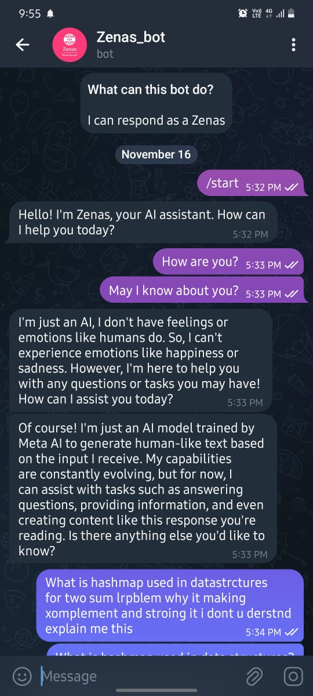
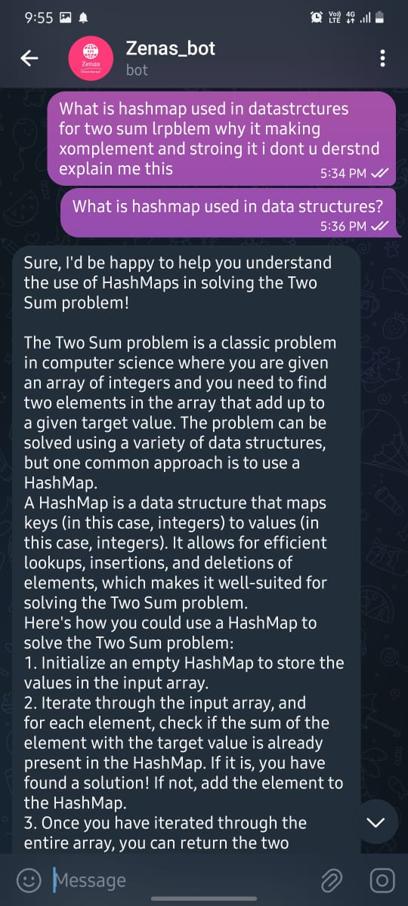

# ZenasBot - Telegram AI Assistant 🌟🌟

ZenasBot is a Telegram-based AI assistant powered by the **Llama 2** language model. It allows users to interact with an AI chatbot directly within Telegram, providing responses to user queries in real-time. This project demonstrates the integration of a large language model (LLM) with a messaging platform, showcasing how AI can be used to enhance user interaction and provide intelligent responses.

## 🧩 Features

- **Real-time AI Responses**: ZenasBot uses the Llama 2 7B model to generate intelligent and context-aware responses to user messages.
- **Telegram Integration**: The bot is built using the `python-telegram-bot` library, allowing seamless integration with Telegram.
- **Typing Indicator**: The bot shows a typing indicator while generating responses, providing a more interactive user experience.
- **Customizable Commands**: The bot supports commands like `/start` and `/help` to guide users on how to interact with it.

## Technologies Used

- **Python**: The core programming language used to build the bot.
- **python-telegram-bot**: A Python library for interacting with the Telegram Bot API.
- **ctransformers**: A library used to load and interact with the Llama 2 model in a lightweight and efficient manner.
- **Llama 2**: A state-of-the-art large language model developed by Meta, used for generating responses.

## 🛠️ How It Works

1. **Initialization**: The bot initializes the Llama 2 model and sets up the Telegram bot using the provided token.
2. **Command Handling**: The bot listens for commands like `/start` and `/help` and responds with appropriate messages.
3. **Message Handling**: When a user sends a message, the bot generates a response using the Llama 2 model and sends it back to the user.
4. **Error Handling**: The bot includes basic error handling to manage any issues that arise during message processing.

## 🖥️ Preview
### **Chatbot Screenshot**


### **Chatbot Screenshot**


## Setup Instructions

1. **Install Dependencies**: Install the required Python libraries using pip:
   ```bash
   pip install python-telegram-bot ctransformers
2. **Download Llama 2 Model**: Download the Llama 2 model file (llama-2-7b-chat.Q4_K_M.gguf) from TheBloke's Hugging Face repository and place it in the project directory.

3. **Set Telegram Token**: Replace the TELEGRAM_TOKEN in the main.py file with your actual Telegram bot token.

4. **Run the Bot**: Execute the bot using the following command:
    ```bash
    python main.py

## Future Enhancements
 - Support for More Models: Integrate other language models like GPT or Mistral for diverse use cases.

 - Multi-Language Support: Add support for multiple languages to make the bot accessible to a wider audience.

 - Advanced Error Handling: Improve error handling and logging for better debugging and user experience.

## 🤝 Contributing
Contributions are welcome! If you'd like to contribute to this project, please fork the repository and submit a pull request with your changes.

## 📜 License
This project is licensed under the MIT License. See the LICENSE file for more details.
